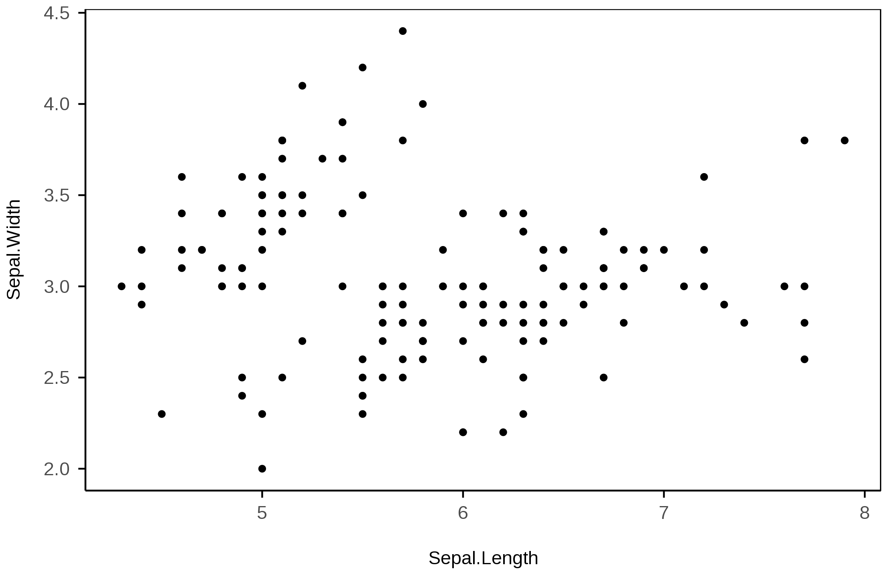
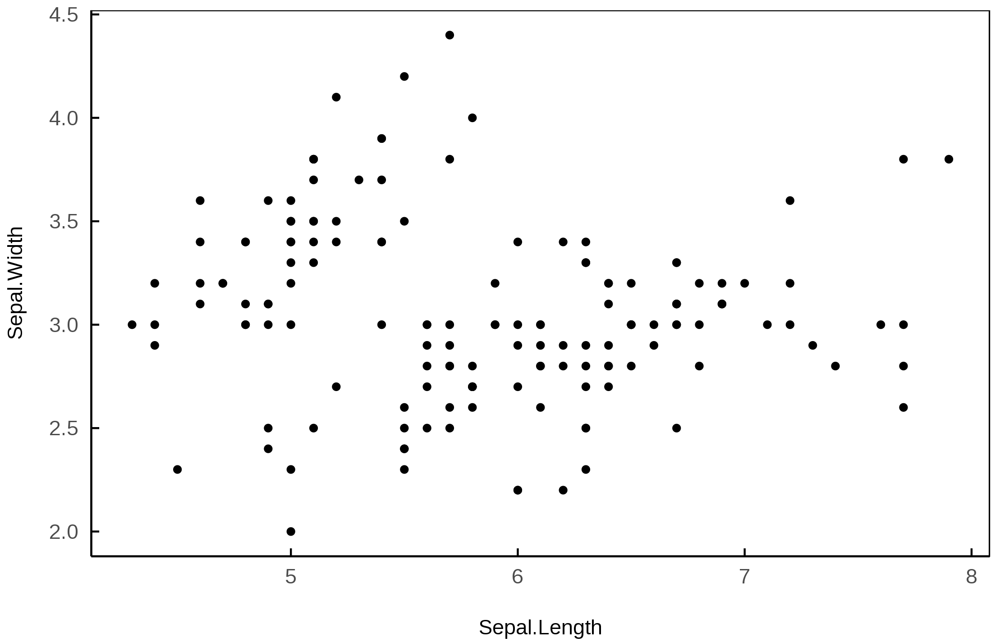

Summary
--------

Introducing a ggplot2 theme to make it easier to produce figures that meet the format requirements of academic journals.

Summary
--------

Install the development version of ggpub using [devtools](https://github.com/hadley/devtools):

```
library(devtools)
install_github("robertwilson190/ggpub")
```
Basic usage
--------
The theme theme_pub is designed to make creating journal-ready figures using ggplot2 relatively pain free. I will begin with data from iris data set. Here is what it looks like using ggplot2's defaults.

``` r
library(ggplot2)

ggplot(iris, aes(Sepal.Length, Sepal.Width))+
	geom_point()
```


This kind of plot will be rejected by most journals. For a start many hold to the outdated idea that everything needs a white background. There are some options within ggplot2. For example, here is theme_classic:

``` r
ggplot(iris, aes(Sepal.Length, Sepal.Width))+
	geom_point()+
	theme_classic()
```


In many cases this will provide a figure that is acceptable in a journal. But in others it will not. For example, there are journals who insist axis ticks point inwards, or insist that there should be a full border around the plot.

So, here I will introduce theme_pub, a theme that makes it easy to satisfy both publishers and your own desire for an aethetically pleasing figure.

The theme defaults to what I believe are the requirements of the most journals: a plain white background, no grid, outer axes ticks, and a rectangular border around the plot.

``` r
library(ggpub)
ggplot(iris, aes(Sepal.Length, Sepal.Width))+
	geom_point()+
	theme_pub()
```


If the journal requires inner axes ticks, this can easily be added using the "ticks_type" command:
``` r
library(ggpub)
ggplot(iris, aes(Sepal.Length, Sepal.Width))+
	geom_point()+
	theme_pub(ticks_type = "inner")
```



